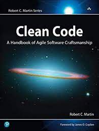
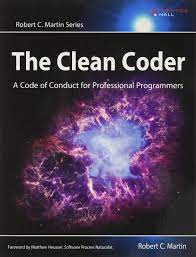
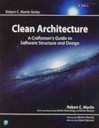
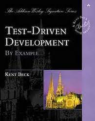
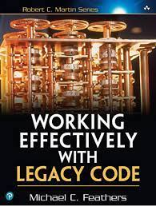

# Development Books






## About this Kata
This short and simple Kata should be performed using Test Driven Development (TDD).

There is a series of books about software development that have been read by a lot of developers who want to improve their development skills. Let’s say an editor, in a gesture of immense generosity to mankind (and to increase sales as well), is willing to set up a pricing model where you can get discounts when you buy these books. The available books are :

- Clean Code (Robert Martin, 2008).
- The Clean Coder (Robert Martin, 2011).
- Clean Architecture (Robert Martin, 2017).
- Test Driven Development by Example (Kent Beck, 2003).
- Working Effectively With Legacy Code (Michael C. Feathers, 2004).

## Rules
One copy of the five books costs 50 EUR.

- If, however, you buy two different books from the series, you get a 5% discount on those two books.
- If you buy 3 different books, you get a 10% discount.
- With 4 different books, you get a 20% discount.
- If you go for the whole hog, and buy all 5, you get a huge 25% discount.
- Note that if you buy, say, 4 books, of which 3 are different titles, you get a 10% discount on the 3 that form part of a set, but the 4th book still costs 50 EUR.

## Software Requirements

- **Java** : 17
- **Springboot** : 3.2
- **Maven** :  3.x
- **JUnit** : 5.x

## Commit Message Style Guide
The project have followed the [Udacity Git Commit Message Style Guide](https://udacity.github.io/git-styleguide/), which provides a consistent format for writing commit messages.
Each commit messages contains **Title**. The title consists of the type of the message and subject. `type: Subject`

#### Commit Types

- **feat**: A new feature
- **fix**: A bug fix
- **docs**: Changes to documentation
- **style**: Code formatting changes (e.g., fixing indentation, removing spaces, etc.)
- **refactor**: Code refactoring without affecting functionality
- **test**: Adding or refactoring tests
- **chore**: Updates to build processes or auxiliary tools (e.g., package manager configs)

## How to Build and run the Application

- Clone this repository:
   ```bash
   https://github.com/2025-DEV1-015/Development_Books.git
- Build the project and run the tests by running
    ```bash
    mvn clean install
- The **Model Classes** used in the project are generated from the **OpenAPI** specification during the build process. Running `mvn clean install` will regenerate the models as part of the build.

- Run main class from IDE (IntelliJ/Eclipse):
  ```bash
  Navigate to DevelopmentBooksApplication
  Click Run

- Once started, the application will be available at:
  ```bash
  http://localhost:8080
  
## Sample Input and Output

The following is a sample input to the Development Books API and the corresponding output:

### Sample Input
This JSON input represents the List of Books with title and quantity.

- File: `src/main/resources/examples/sample-input.json`
- Example:
  ```json
  {
    "books": [
        {
            "title": "Clean Code",
            "quantity": 2
        },
        {
            "title": "The Clean Coder",
            "quantity": 2
        },
        {
            "title": "Clean Architecture",
            "quantity": 2
        },
        {
            "title": "Test Driven Development by Example",
            "quantity": 1
        },
        {
            "title": "Working Effectively With Legacy Code",
            "quantity": 1
        }
    ]
  }

### Sample Output
This JSON response represents Development Books with prices grouped based on applicable discounts.
- File: `src/main/resources/examples/sample-output.json`
- Example:
  ```json
  {
    "groups": [
        {
            "books": [
                "Clean Code",
                "The Clean Coder",
                "Clean Architecture",
                "Test Driven Development by Example"
            ],
            "groupSize": 4,
            "discountPercentage": 20,
            "afterdiscountPrice": 160
        },
        {
            "books": [
                "Clean Code",
                "The Clean Coder",
                "Clean Architecture",
                "Working Effectively With Legacy Code"
            ],
            "groupSize": 4,
            "discountPercentage": 20,
            "afterdiscountPrice": 160
        }
    ],
    "totalPrice": 400,
    "discountedPrice": 320
  }

## Test reports

- Once after successful build of
  `mvn clean install`, navigate to target folder of the project root directory
- **Jacoco code coverage report :** Code Coverage report will be available in `target\site\jacoco` folder. View the report by launching **index.html**
- **pit test coverage report:** Mutation Coverage report will be available in `target\pit-reports` folder. View the report by launchig **index.html**
